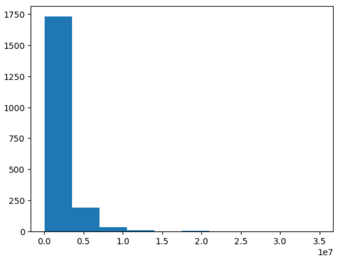
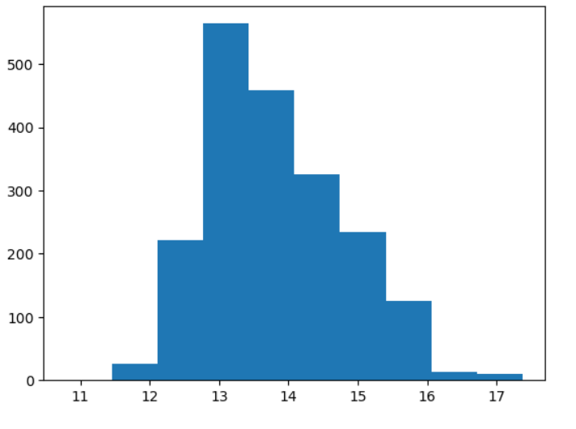
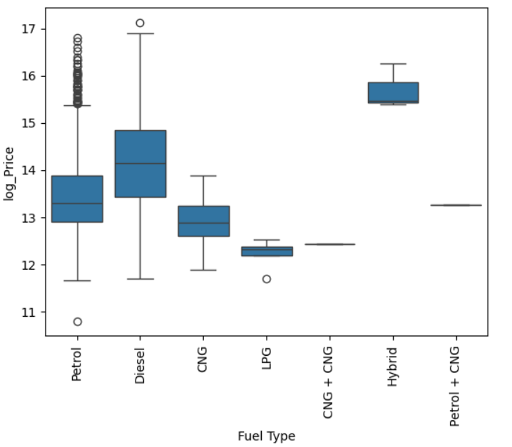
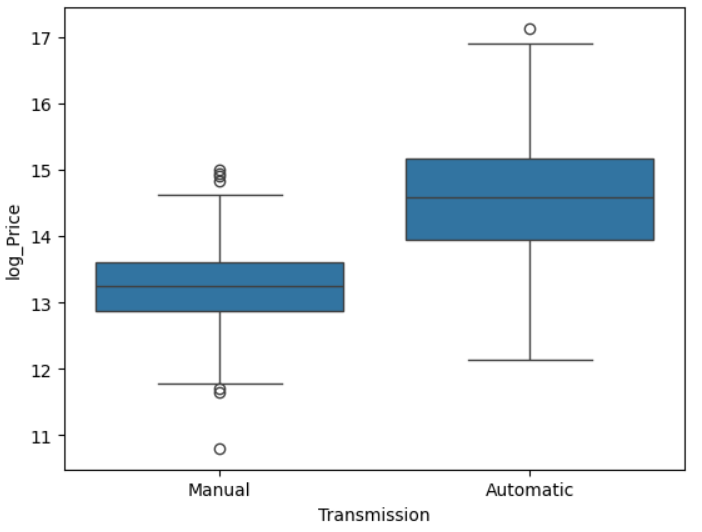
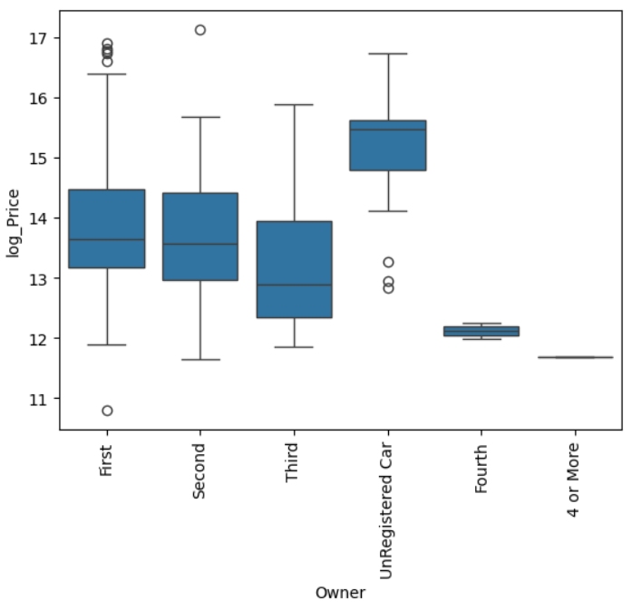
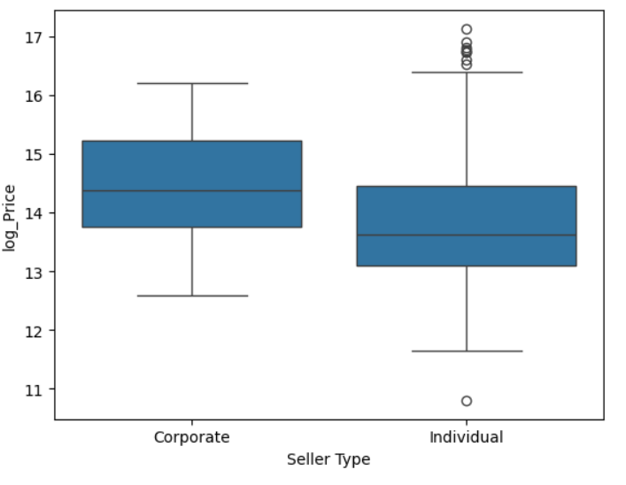
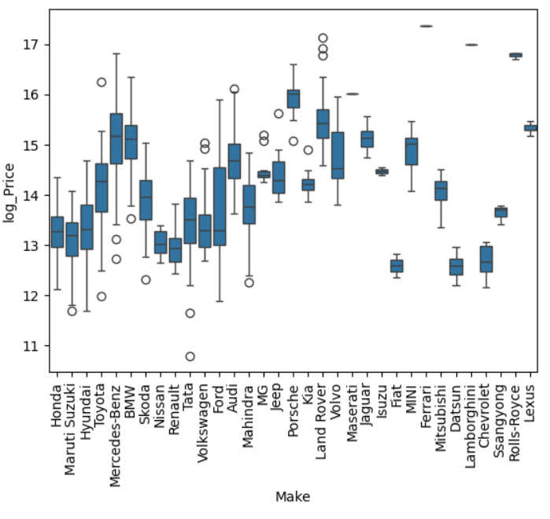
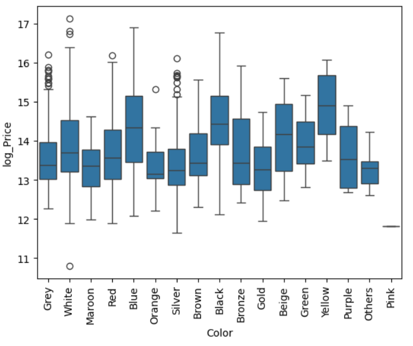
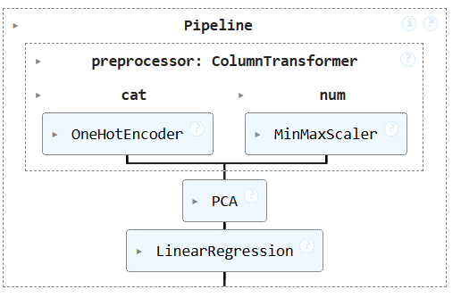
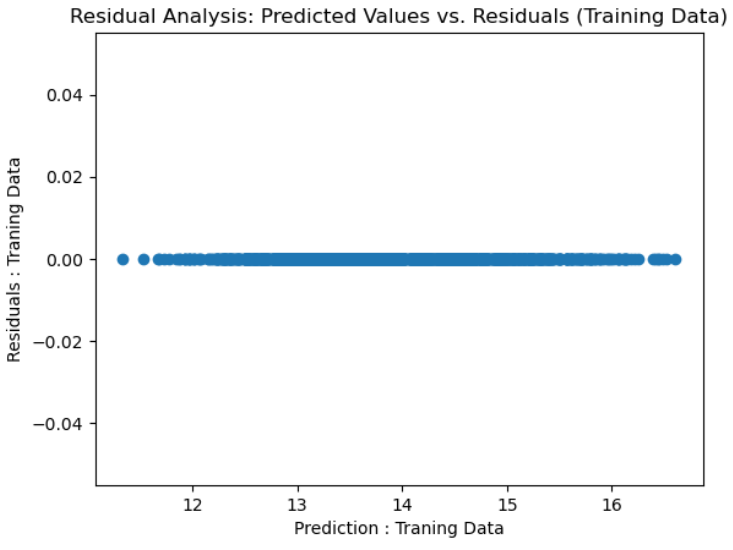

# Car Price Prediction Model

A data science project that predicts used car prices using machine learning. This repo includes end-to-end steps: data exploration, preprocessing, model training, evaluation, and visualizations. Built with Python, Pandas, Scikit-learn, and Matplotlib/Seaborn.

---

---

## Exploratory Data Analysis (EDA)

Here are some of the key insights from the EDA:

### 🔹 Distribution of Raw Prices

### 🔹 Distribution of Log Prices

### 🔹 Price vs Fuel Type

### 🔹 Price vs Transmission Type

### 🔹 Price vs Owner Type

### 🔹 Price vs Seller Type

### 🔹 Price vs Car Make

### 🔹 Price vs Color

---

## Model & Pipeline

- Features encoded using One-Hot Encoding
- Log transformation applied on skewed price
- Regression models tried: **Linear Regression, Ridge, Lasso, Random Forest**
- Final model evaluated using **R² score** and **residual analysis**

### 🔸 Pipeline Architecture

### 🔸 Residuals of Final Model

---

## 📈 Results

- Best model achieved high performance on test set
- Log-transformed prices allowed better residual behavior
- The final model generalizes well and handles categorical features efficiently

---

## 🛠️ Tech Stack

- **Python** 3.x
- **Pandas**, **NumPy**
- **Scikit-learn**
- **Matplotlib**, **Seaborn**
- **Jupyter Notebook**

---

